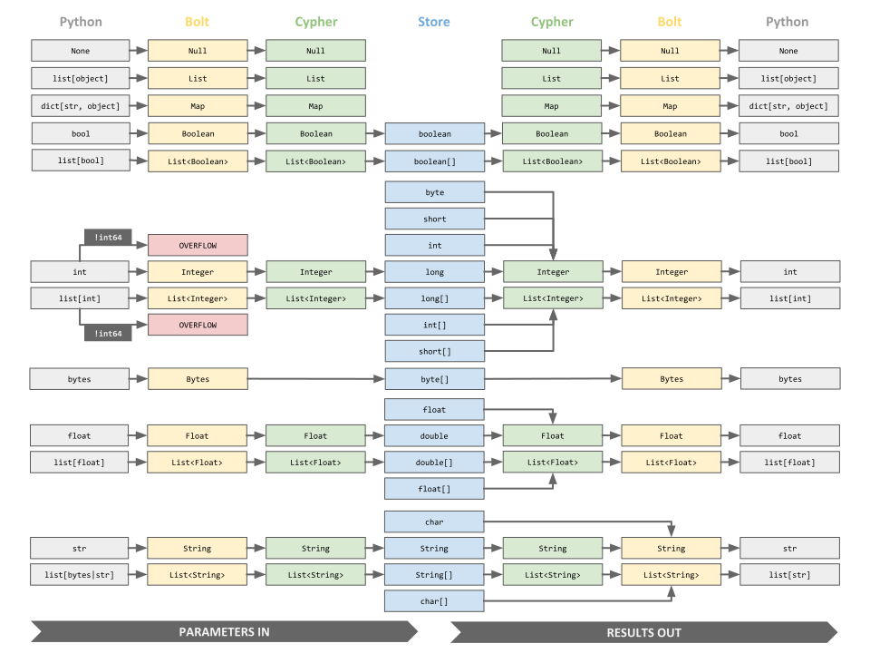

.. _api-documentation:

#################
API Documentation
#################

*************
GraphDatabase
*************

Driver Construction
===================

The :class:`neo4j.Driver` construction is done via a `classmethod` on the :class:`neo4j.GraphDatabase` class.

.. autoclass:: neo4j.GraphDatabase
   :members: driver

Driver creation example:

.. code-block:: python

    from neo4j import GraphDatabase

    uri = "neo4j://example.com:7687"
    driver = GraphDatabase.driver(uri, auth=("neo4j", "password"))

    driver.close()  # close the driver object

For basic authentication, `auth` can be a simple tuple, for example:

.. code-block:: python

   auth = ("neo4j", "password")

This will implicitly create a :class:`neo4j.Auth` with a ``scheme="basic"``.
Other authentication methods are described under :ref:`auth-ref`.

``with`` block context example:

.. code-block:: python

    from neo4j import GraphDatabase

    uri = "neo4j://example.com:7687"
    with GraphDatabase.driver(uri, auth=("neo4j", "password")) as driver:
        # use the driver

.. _uri-ref:

URI
===

On construction, the `scheme` of the URI determines the type of :class:`neo4j.Driver` object created.

Available valid URIs:

+ ``bolt://host[:port]``
+ ``bolt+ssc://host[:port]``
+ ``bolt+s://host[:port]``
+ ``neo4j://host[:port][?routing_context]``
+ ``neo4j+ssc://host[:port][?routing_context]``
+ ``neo4j+s://host[:port][?routing_context]``

.. code-block:: python

    uri = "bolt://example.com:7687"

.. code-block:: python

    uri = "neo4j://example.com:7687"

Each supported scheme maps to a particular :class:`neo4j.Driver` subclass that implements a specific behaviour.

+------------------------+---------------------------------------------------------------------------------------------------------------------------------------+
| URI Scheme             | Driver Object and Setting                                                                                                             |
+========================+=======================================================================================================================================+
| bolt                   | :ref:`bolt-driver-ref` with no encryption.                                                                                            |
+------------------------+---------------------------------------------------------------------------------------------------------------------------------------+
| bolt+ssc               | :ref:`bolt-driver-ref` with encryption (accepts self signed certificates).                                                            |
+------------------------+---------------------------------------------------------------------------------------------------------------------------------------+
| bolt+s                 | :ref:`bolt-driver-ref` with encryption (accepts only certificates signed by a certificate authority), full certificate checks.        |
+------------------------+---------------------------------------------------------------------------------------------------------------------------------------+
| neo4j                  | :ref:`neo4j-driver-ref` with no encryption.                                                                                           |
+------------------------+---------------------------------------------------------------------------------------------------------------------------------------+
| neo4j+ssc              | :ref:`neo4j-driver-ref` with encryption (accepts self signed certificates).                                                           |
+------------------------+---------------------------------------------------------------------------------------------------------------------------------------+
| neo4j+s                | :ref:`neo4j-driver-ref` with encryption (accepts only certificates signed by a certificate authority), full certificate checks.       |
+------------------------+---------------------------------------------------------------------------------------------------------------------------------------+

.. note::

    See https://neo4j.com/docs/operations-manual/current/configuration/ports/ for Neo4j ports.

.. _auth-ref:

Auth
====

To authenticate with Neo4j the authentication details are supplied at driver creation.

The auth token is an object of the class :class:`neo4j.Auth` containing the details.

.. autoclass:: neo4j.Auth

Example:

.. code-block:: python

    import neo4j

    auth = neo4j.Auth("basic", "neo4j", "password")

Auth Token Helper Functions
---------------------------

Alternatively, one of the auth token helper functions can be used.

.. autofunction:: neo4j.basic_auth

.. autofunction:: neo4j.kerberos_auth

.. autofunction:: neo4j.bearer_auth

.. autofunction:: neo4j.custom_auth

******
Driver
******

Every Neo4j-backed application will require a :class:`neo4j.Driver` object.

This object holds the details required to establish connections with a Neo4j database, including server URIs, credentials and other configuration.
:class:`neo4j.Driver` objects hold a connection pool from which :class:`neo4j.Session` objects can borrow connections.
Closing a driver will immediately shut down all connections in the pool.

.. autoclass:: neo4j.Driver()
   :members: session, encrypted, close

.. _driver-configuration-ref:

Driver Configuration
====================

Additional configuration can be provided via the :class:`neo4j.Driver` constructor.

+ :ref:`connection-acquisition-timeout-ref`
+ :ref:`connection-timeout-ref`
+ :ref:`encrypted-ref`
+ :ref:`keep-alive-ref`
+ :ref:`max-connection-lifetime-ref`
+ :ref:`max-connection-pool-size-ref`
+ :ref:`max-transaction-retry-time-ref`
+ :ref:`resolver-ref`
+ :ref:`ssl-context-ref`
+ :ref:`trusted-certificates-ref`
+ :ref:`user-agent-ref`

.. _connection-acquisition-timeout-ref:

``connection_acquisition_timeout``
----------------------------------
The maximum amount of time in seconds a session will wait when requesting a connection from the connection pool.
Since the process of acquiring a connection may involve creating a new connection, ensure that the value of this configuration is higher than the configured :ref:`connection-timeout-ref`.

:Type: ``float``
:Default: ``60.0``

.. _connection-timeout-ref:

``connection_timeout``
----------------------
The maximum amount of time in seconds to wait for a TCP connection to be established.

:Type: ``float``
:Default: ``30.0``

.. _encrypted-ref:

``encrypted``
-------------
Specify whether to use an encrypted connection between the driver and server.

This setting does not have any effect if a custom ``ssl_context`` is configured.

:Type: ``bool``
:Default: ``False``

.. _keep-alive-ref:

``keep_alive``
--------------
Specify whether TCP keep-alive should be enabled.

:Type: ``bool``
:Default: ``True``

**This is experimental.** (See :ref:`filter-warnings-ref`)

.. _max-connection-lifetime-ref:

``max_connection_lifetime``
---------------------------

The maximum duration in seconds that the driver will keep a connection for before being removed from the pool.

:Type: ``float``
:Default: ``3600``

.. _max-connection-pool-size-ref:

``max_connection_pool_size``
----------------------------
The maximum total number of connections allowed, per host (i.e. cluster nodes), to be managed by the connection pool.

:Type: ``int``
:Default: ``100``

.. _max-transaction-retry-time-ref:

``max_transaction_retry_time``
------------------------------
 The maximum amount of time in seconds that a managed transaction will retry before failing.

:Type: ``float``
:Default: ``30.0``

.. _resolver-ref:

``resolver``
------------
A custom resolver function to resolve host and port values ahead of DNS resolution.
This function is called with a 2-tuple of (host, port) and should return an iterable of 2-tuples (host, port).

If no custom resolver function is supplied, the internal resolver moves straight to regular DNS resolution.

For example:

.. code-block:: python

   from neo4j import GraphDatabase

   def custom_resolver(socket_address):
       if socket_address == ("example.com", 9999):
           yield "::1", 7687
           yield "127.0.0.1", 7687
       else:
           from socket import gaierror
           raise gaierror("Unexpected socket address %r" % socket_address)

   driver = GraphDatabase.driver("neo4j://example.com:9999",
                auth=("neo4j", "password"),
                resolver=custom_resolver)

:Default: :const:`None`

.. _ssl-context-ref:

``ssl_context``
---------------
Specify a custom SSL context to use for wrapping connections.

If give, ``encrypted`` and ``trusted_certificates`` have no effect.

:Type: :class:`ssl.SSLContext` or :const:`None`
:Default: :const:`None`

.. _trusted-certificates-ref:

``trusted_certificates``
------------------------
Specify how to determine the authenticity of encryption certificates provided by the Neo4j instance on connection.

This setting does not have any effect if ``encrypted`` is set to ``False`` or a
custom ``ssl_context`` is configured.

:Type: :class:`list` or :const:`None`

**None** (default)
    Trust server certificates that can be verified against the system
    certificate authority. This option is primarily intended for use with
    full certificates.

**[] (empty list)**
    Trust any server certificate. This ensures that communication
    is encrypted but does not verify the server certificate against a
    certificate authority. This option is primarily intended for use with
    the default auto-generated server certificate.

**["<path>", ...]**
    Trust server certificates that can be verified against the certificate
    authority at the specified paths. This option is primarily intended for
    self-signed and custom certificates.

:Default: :const:`None`

.. _user-agent-ref:

``user_agent``
--------------
Specify the client agent name.

:Type: ``str``
:Default: *The Python Driver will generate a user agent name.*

Driver Object Lifetime
======================

For general applications, it is recommended to create one top-level :class:`neo4j.Driver` object that lives for the lifetime of the application.

For example:

.. code-block:: python

    from neo4j import GraphDatabase

    class Application:

        def __init__(self, uri, user, password)
            self.driver = GraphDatabase.driver(uri, auth=(user, password))

        def close(self):
            self.driver.close()

Connection details held by the :class:`neo4j.Driver` are immutable.
Therefore if, for example, a password is changed, a replacement :class:`neo4j.Driver` object must be created.
More than one :class:`.Driver` may be required if connections to multiple databases, or connections as multiple users, are required,
unless when using impersonation (:ref:`impersonated-user-ref`).

:class:`neo4j.Driver` objects are thread-safe but cannot be shared across processes.
Therefore, ``multithreading`` should generally be preferred over ``multiprocessing`` for parallel database access.
If using ``multiprocessing`` however, each process will require its own :class:`neo4j.Driver` object.

.. _bolt-driver-ref:

BoltDriver
==========

URI schemes:
    ``bolt``, ``bolt+ssc``, ``bolt+s``

Will result in:

.. autoclass:: neo4j.BoltDriver

.. _neo4j-driver-ref:

Neo4jDriver
===========

URI schemes:
    ``neo4j``, ``neo4j+ssc``, ``neo4j+s``

Will result in:

.. autoclass:: neo4j.Neo4jDriver

***********************
Sessions & Transactions
***********************
All database activity is co-ordinated through two mechanisms: the :class:`neo4j.Session` and the :class:`neo4j.Transaction`.

A :class:`neo4j.Session` is a logical container for any number of causally-related transactional units of work.
Sessions automatically provide guarantees of causal consistency within a clustered environment but multiple sessions can also be causally chained if required.
Sessions provide the top level of containment for database activity.
Session creation is a lightweight operation and *sessions are not thread safe*.

Connections are drawn from the :class:`neo4j.Driver` connection pool as required.

A :class:`neo4j.Transaction` is a unit of work that is either committed in its entirety or is rolled back on failure.

.. _session-construction-ref:

********************
Session Construction
********************

To construct a :class:`neo4j.Session` use the :meth:`neo4j.Driver.session` method.

.. code-block:: python

    from neo4j import GraphDatabase

    driver = GraphDatabase(uri, auth=(user, password))
    session = driver.session()
    result = session.run("MATCH (a:Person) RETURN a.name AS name")
    names = [record["name"] for record in result]
    session.close()
    driver.close()

Sessions will often be created and destroyed using a *with block context*.

.. code-block:: python

    with driver.session() as session:
        result = session.run("MATCH (a:Person) RETURN a.name AS name")
        # do something with the result...

Sessions will often be created with some configuration settings, see :ref:`session-configuration-ref`.

.. code-block:: python

    with driver.session(database="example_database", fetch_size=100) as session:
        result = session.run("MATCH (a:Person) RETURN a.name AS name")
        # do something with the result...

*******
Session
*******

.. autoclass:: neo4j.Session()

    .. automethod:: close

    .. automethod:: run

    .. automethod:: last_bookmarks

    .. automethod:: last_bookmark

    .. automethod:: begin_transaction

    .. automethod:: read_transaction

    .. automethod:: write_transaction

Query
=====

.. autoclass:: neo4j.Query

.. _session-configuration-ref:

Session Configuration
=====================

To construct a :class:`neo4j.Session` use the :meth:`neo4j.Driver.session` method. This section describes the session configuration key-word arguments.

+ :ref:`bookmarks-ref`
+ :ref:`database-ref`
+ :ref:`default-access-mode-ref`
+ :ref:`fetch-size-ref`

.. _bookmarks-ref:

``bookmarks``
-------------
Optional :class:`neo4j.Bookmarks`. Use this to causally chain sessions.
See :meth:`Session.last_bookmarks` or :meth:`AsyncSession.last_bookmarks` for
more information.

.. deprecated:: 5.0
    Alternatively, an iterable of strings can be passed. This usage is
    deprecated and will be removed in a future release. Please use a
    :class:`neo4j.Bookmarks` object instead.

:Default: ``None``

.. _database-ref:

``database``
------------
Name of the database to query.

:Type: ``str``, ``neo4j.DEFAULT_DATABASE``

.. py:attribute:: neo4j.DEFAULT_DATABASE
   :noindex:

   This will use the default database on the Neo4j instance.

.. Note::

    The default database can be set on the Neo4j instance settings.

.. Note::
    It is recommended to always specify the database explicitly when possible.
    This allows the driver to work more efficiently, as it will not have to
    resolve the home database first.

.. code-block:: python

   from neo4j import GraphDatabase
   driver = GraphDatabase.driver(uri, auth=(user, password))
   session = driver.session(database="system")

:Default: ``neo4j.DEFAULT_DATABASE``

.. _impersonated-user-ref:

``impersonated_user``
---------------------
Name of the user to impersonate.
This means that all actions in the session will be executed in the security
context of the impersonated user. For this, the user for which the
:class:``Driver`` has been created needs to have the appropriate permissions.

:Type: ``str``, None

.. py:data:: None
   :noindex:

   Will not perform impersonation.

.. Note::

    The server or all servers of the cluster need to support impersonation when.
    Otherwise, the driver will raise :py:exc:`.ConfigurationError`
    as soon as it encounters a server that does not.

.. code-block:: python

   from neo4j import GraphDatabase
   driver = GraphDatabase.driver(uri, auth=(user, password))
   session = driver.session(impersonated_user="alice")

:Default: :const:`None`

.. _default-access-mode-ref:

``default_access_mode``
-----------------------
The default access mode.

A session can be given a default access mode on construction.

This applies only in clustered environments and determines whether transactions carried out within that session should be routed to a `read` or `write` server by default.

Transactions (see :ref:`managed-transactions-ref`) within a session can override the access mode passed to that session on construction.

.. note::
    The driver does not parse Cypher queries and cannot determine whether the access mode should be ``neo4j.ACCESS_WRITE`` or ``neo4j.ACCESS_READ``.
    Since the access mode is not passed to the server, this can allow a ``neo4j.ACCESS_WRITE`` statement to be executed for a ``neo4j.ACCESS_READ`` call on a single instance.
    Clustered environments are not susceptible to this loophole as cluster roles prevent it.
    This behaviour should not be relied upon as the loophole may be closed in a future release.

:Type: ``neo4j.WRITE_ACCESS``, ``neo4j.READ_ACCESS``
:Default: ``neo4j.WRITE_ACCESS``

.. _fetch-size-ref:

``fetch_size``
--------------
The fetch size used for requesting messages from Neo4j.

:Type: ``int``
:Default: ``1000``

***********
Transaction
***********

Neo4j supports three kinds of transaction:

+ :ref:`auto-commit-transactions-ref`
+ :ref:`explicit-transactions-ref`
+ :ref:`managed-transactions-ref`

Each has pros and cons but if in doubt, use a managed transaction with a `transaction function`.

.. _auto-commit-transactions-ref:

Auto-commit Transactions
========================
Auto-commit transactions are the simplest form of transaction, available via :py:meth:`neo4j.Session.run`.

These are easy to use but support only one statement per transaction and are not automatically retried on failure.
Auto-commit transactions are also the only way to run ``PERIODIC COMMIT`` statements, since this Cypher clause manages its own transactions internally.

Example:

.. code-block:: python

    import neo4j

    def create_person(driver, name):
        with driver.session(default_access_mode=neo4j.WRITE_ACCESS) as session:
            query = "CREATE (a:Person { name: $name }) RETURN id(a) AS node_id"
            result = session.run(query, name=name)
            record = result.single()
            return record["node_id"]

Example:

.. code-block:: python

    import neo4j

    def get_numbers(driver):
        numbers = []
        with driver.session(default_access_mode=neo4j.READ_ACCESS) as session:
            result = session.run("UNWIND [1, 2, 3] AS x RETURN x")
            for record in result:
                numbers.append(record["x"])
        return numbers

.. _explicit-transactions-ref:

Explicit Transactions
=====================
Explicit transactions support multiple statements and must be created with an explicit :py:meth:`neo4j.Session.begin_transaction` call.

This creates a new :class:`neo4j.Transaction` object that can be used to run Cypher.

It also gives applications the ability to directly control `commit` and `rollback` activity.

.. autoclass:: neo4j.Transaction()

    .. automethod:: run

    .. automethod:: close

    .. automethod:: closed

    .. automethod:: commit

    .. automethod:: rollback

Closing an explicit transaction can either happen automatically at the end of a ``with`` block,
or can be explicitly controlled through the :py:meth:`neo4j.Transaction.commit`, :py:meth:`neo4j.Transaction.rollback` or :py:meth:`neo4j.Transaction.close` methods.

Explicit transactions are most useful for applications that need to distribute Cypher execution across multiple functions for the same transaction.

Example:

.. code-block:: python

    import neo4j

    def create_person(driver, name):
        with driver.session(default_access_mode=neo4j.WRITE_ACCESS) as session:
            tx = session.begin_transaction()
            node_id = create_person_node(tx)
            set_person_name(tx, node_id, name)
            tx.commit()
            tx.close()

    def create_person_node(tx):
        query = "CREATE (a:Person { name: $name }) RETURN id(a) AS node_id"
        name = "default_name"
        result = tx.run(query, name=name)
        record = result.single()
        return record["node_id"]

    def set_person_name(tx, node_id, name):
        query = "MATCH (a:Person) WHERE id(a) = $id SET a.name = $name"
        result = tx.run(query, id=node_id, name=name)
        info = result.consume()
        # use the info for logging etc.

.. _managed-transactions-ref:

Managed Transactions (`transaction functions`)
==============================================
Transaction functions are the most powerful form of transaction, providing access mode override and retry capabilities.

+ :py:meth:`neo4j.Session.write_transaction`
+ :py:meth:`neo4j.Session.read_transaction`

These allow a function object representing the transactional unit of work to be passed as a parameter.
This function is called one or more times, within a configurable time limit, until it succeeds.
Results should be fully consumed within the function and only aggregate or status values should be returned.
Returning a live result object would prevent the driver from correctly managing connections and would break retry guarantees.

Example:

.. code-block:: python

    def create_person(driver, name)
        with driver.session() as session:
            node_id = session.write_transaction(create_person_tx, name)

    def create_person_tx(tx, name):
        query = "CREATE (a:Person { name: $name }) RETURN id(a) AS node_id"
        result = tx.run(query, name=name)
        record = result.single()
        return record["node_id"]

To exert more control over how a transaction function is carried out, the :func:`neo4j.unit_of_work` decorator can be used.

.. autofunction:: neo4j.unit_of_work

******
Result
******

Every time a query is executed, a :class:`neo4j.Result` is returned.

This provides a handle to the result of the query, giving access to the records within it as well as the result metadata.

Results also contain a buffer that automatically stores unconsumed records when results are consumed out of order.

A :class:`neo4j.Result` is attached to an active connection, through a :class:`neo4j.Session`, until all its content has been buffered or consumed.

.. autoclass:: neo4j.Result()

    .. describe:: iter(result)

    .. describe:: next(result)

    .. automethod:: keys

    .. automethod:: consume

    .. automethod:: single

    .. automethod:: peek

    .. automethod:: graph

       **This is experimental.** (See :ref:`filter-warnings-ref`)

    .. automethod:: value

    .. automethod:: values

    .. automethod:: data

See https://neo4j.com/docs/driver-manual/current/cypher-workflow/#driver-type-mapping for more about type mapping.

Graph
=====

.. autoclass:: neo4j.graph.Graph()

    A local, self-contained graph object that acts as a container for :class:`.Node` and :class:`neo4j.Relationship` instances.
    This is typically obtained via the :meth:`neo4j.Result.graph` method.

    .. autoattribute:: nodes

    .. autoattribute:: relationships

    .. automethod:: relationship_type

**This is experimental.** (See :ref:`filter-warnings-ref`)

******
Record
******

.. autoclass:: neo4j.Record()

    A :class:`neo4j.Record` is an immutable ordered collection of key-value
    pairs. It is generally closer to a :py:class:`namedtuple` than to an
    :py:class:`OrderedDict` inasmuch as iteration of the collection will
    yield values rather than keys.

    .. describe:: Record(iterable)

        Create a new record based on an dictionary-like iterable.
        This can be a dictionary itself, or may be a sequence of key-value pairs, each represented by a tuple.

    .. describe:: record == other

        Compare a record for equality with another value.
        The `other` value may be any `Sequence` or `Mapping`, or both.
        If comparing with a `Sequence`, the values are compared in order.
        If comparing with a `Mapping`, the values are compared based on their keys.
        If comparing with a value that exhibits both traits, both comparisons must be true for the values to be considered equal.

    .. describe:: record != other

        Compare a record for inequality with another value.
        See above for comparison rules.

    .. describe:: hash(record)

        Create a hash for this record.
        This will raise a :exc:`TypeError` if any values within the record are unhashable.

    .. describe:: record[index]

        Obtain a value from the record by index.
        This will raise an :exc:`IndexError` if the specified index is out of range.

    .. describe:: record[i:j]

        Derive a sub-record based on a start and end index.
        All keys and values within those bounds will be copied across in the same order as in the original record.

    .. automethod:: keys

    .. describe:: record[key]

        Obtain a value from the record by key.
        This will raise a :exc:`KeyError` if the specified key does not exist.

    .. automethod:: get(key, default=None)

    .. automethod:: index(key)

    .. automethod:: items

    .. automethod:: value(key=0, default=None)

    .. automethod:: values

    .. automethod:: data

*************
ResultSummary
*************

.. autoclass:: neo4j.ResultSummary()
   :members:

SummaryCounters
===============

.. autoclass:: neo4j.SummaryCounters()
    :members:

ServerInfo
==========

.. autoclass:: neo4j.ServerInfo()
   :members:

***************
Core Data Types
***************

Cypher supports a set of core data types that all map to built-in types in Python.

These include the common `Boolean`, `Integer`, `Float` and `String` types as well as `List` and `Map` that can hold heterogenous collections of any other type.

The core types with their general mappings are listed below:

+------------------------+---------------------------------------------------------------------------------------------------------------------------+
| Cypher Type            | Python Type                                                                                                               |
+========================+===========================================================================================================================+
| Null                   | :const:`None`                                                                                                             |
+------------------------+---------------------------------------------------------------------------------------------------------------------------+
| Boolean                | ``bool``                                                                                                                  |
+------------------------+---------------------------------------------------------------------------------------------------------------------------+
| Integer                | ``int``                                                                                                                   |
+------------------------+---------------------------------------------------------------------------------------------------------------------------+
| Float                  | ``float``                                                                                                                 |
+------------------------+---------------------------------------------------------------------------------------------------------------------------+
| String                 | ``str``                                                                                                                   |
+------------------------+---------------------------------------------------------------------------------------------------------------------------+
| Bytes :sup:`[1]`       | ``bytearray``                                                                                                             |
+------------------------+---------------------------------------------------------------------------------------------------------------------------+
| List                   | ``list``                                                                                                                  |
+------------------------+---------------------------------------------------------------------------------------------------------------------------+
| Map                    | ``dict``                                                                                                                  |
+------------------------+---------------------------------------------------------------------------------------------------------------------------+

.. Note::

   1. `Bytes` is not an actual Cypher type but is transparently passed through when used in parameters or query results.

In reality, the actual conversions and coercions that occur as values are passed through the system are more complex than just a simple mapping.
The diagram below illustrates the actual mappings between the various layers, from driver to data store, for the core types.

****************
Graph Data Types
****************

Cypher queries can return entire graph structures as well as individual property values.

The graph data types detailed here model graph data returned from a Cypher query.
Graph values cannot be passed in as parameters as it would be unclear whether the entity was intended to be passed by reference or by value.
The identity or properties of that entity should be passed explicitly instead.

The driver contains a corresponding class for each of the graph types that can be returned.

=============  =================================
Cypher Type    Python Type
=============  =================================
Node           :class:`neo4j.graph.Node`
Relationship   :class:`neo4j.graph.Relationship`
Path           :class:`neo4j.graph.Path`
=============  =================================

Node
====

.. autoclass:: neo4j.graph.Node()

    .. describe:: node == other

        Compares nodes for equality.

    .. describe:: node != other

        Compares nodes for inequality.

    .. describe:: hash(node)

        Computes the hash of a node.

    .. describe:: len(node)

        Returns the number of properties on a node.

    .. describe:: iter(node)

        Iterates through all properties on a node.

    .. describe:: node[key]

        Returns a node property by key.
        Raises :exc:`KeyError` if the key does not exist.

    .. describe:: key in node

        Checks whether a property key exists for a given node.

    .. autoattribute:: graph

    .. autoattribute:: id

    .. autoattribute:: labels

    .. automethod:: get

    .. automethod:: keys

    .. automethod:: values

    .. automethod:: items

Relationship
============

.. autoclass:: neo4j.graph.Relationship()

    .. describe:: relationship == other

        Compares relationships for equality.

    .. describe:: relationship != other

        Compares relationships for inequality.

    .. describe:: hash(relationship)

        Computes the hash of a relationship.

    .. describe:: len(relationship)

        Returns the number of properties on a relationship.

    .. describe:: iter(relationship)

        Iterates through all properties on a relationship.

    .. describe:: relationship[key]

        Returns a relationship property by key.
        Raises :exc:`KeyError` if the key does not exist.

    .. describe:: key in relationship

        Checks whether a property key exists for a given relationship.

    .. describe:: type(relationship)

        Returns the type (class) of a relationship.
        Relationship objects belong to a custom subtype based on the type name in the underlying database.

    .. autoattribute:: graph

    .. autoattribute:: id

    .. autoattribute:: nodes

    .. autoattribute:: start_node

    .. autoattribute:: end_node

    .. autoattribute:: type

    .. automethod:: get

    .. automethod:: keys

    .. automethod:: values

    .. automethod:: items

Path
====

.. autoclass:: neo4j.graph.Path()

    .. describe:: path == other

        Compares paths for equality.

    .. describe:: path != other

        Compares paths for inequality.

    .. describe:: hash(path)

        Computes the hash of a path.

    .. describe:: len(path)

        Returns the number of relationships in a path.

    .. describe:: iter(path)

        Iterates through all the relationships in a path.

    .. autoattribute:: graph

    .. autoattribute:: nodes

    .. autoattribute:: start_node

    .. autoattribute:: end_node

    .. autoattribute:: relationships

******************
Spatial Data Types
******************

Cypher has built-in support for handling spatial values (points),
and the underlying database supports storing these point values as properties on nodes and relationships.

https://neo4j.com/docs/cypher-manual/current/syntax/spatial/

=================  =====================================
Cypher Type        Python Type
=================  =====================================
Point              :class:`neo4j.spatial.Point`

Point (Cartesian)  :class:`neo4j.spatial.CartesianPoint`
Point (WGS-84)     :class:`neo4j.spatial.WGS84Point`
=================  =====================================

Point
=====

.. autoclass:: neo4j.spatial.Point
   :members:

CartesianPoint
==============

.. autoclass:: neo4j.spatial.CartesianPoint
    :show-inheritance:

    .. autoproperty:: srid

    .. autoproperty:: x

    .. autoproperty:: y

    .. autoproperty:: z

    .. automethod:: count

    .. automethod:: index

.. code-block:: python

    point=CartesianPoint((1.23, 4.56)

    print(point.x, point.y)

.. code-block:: python

    point=CartesianPoint((1.23, 4.56, 7.89)

    print(point.x, point.y, point.z)

WGS84Point
==========

.. autoclass:: neo4j.spatial.WGS84Point
    :show-inheritance:

    .. autoproperty:: srid

    .. autoproperty:: x

    .. autoproperty:: y

    .. autoproperty:: z

    .. autoproperty:: longitude

    .. autoproperty:: latitude

    .. autoproperty:: height

    .. automethod:: count

    .. automethod:: index

.. code-block:: python

    point=WGS84Point((1.23, 4.56))
    print(point.longitude, point.latitude)

.. code-block:: python

    point=WGS84Point((1.23, 4.56, 7.89))
    print(point.longitude, point.latitude, point.height)

*******************
Temporal Data Types
*******************

.. include:: types/temporal.rst

See topic :ref:`temporal-data-types` for more details.

.. _errors-ref:

******
Errors
******

Neo4j Errors
============

Neo4j Execution Errors

* :class:`neo4j.exceptions.Neo4jError`

  * :class:`neo4j.exceptions.ClientError`

  * :class:`neo4j.exceptions.DatabaseError`

  * :class:`neo4j.exceptions.TransientError`

.. autoclass:: neo4j.exceptions.Neo4jError

    .. autoproperty:: message

    .. autoproperty:: code

    There are many Neo4j status codes, see `status code <https://neo4j.com/docs/status-codes/current/>`_.

    .. autoproperty:: classification

    .. autoproperty:: category

    .. autoproperty:: title

.. autoclass:: neo4j.exceptions.ClientError
    :show-inheritance:

.. autoclass:: neo4j.exceptions.CypherSyntaxError
    :show-inheritance:

.. autoclass:: neo4j.exceptions.CypherTypeError
    :show-inheritance:

.. autoclass:: neo4j.exceptions.ConstraintError
    :show-inheritance:

.. autoclass:: neo4j.exceptions.AuthError
    :show-inheritance:

.. autoclass:: neo4j.exceptions.Forbidden
    :show-inheritance:

.. autoclass:: neo4j.exceptions.ForbiddenOnReadOnlyDatabase
    :show-inheritance:

.. autoclass:: neo4j.exceptions.NotALeader
    :show-inheritance:

.. autoclass:: neo4j.exceptions.DatabaseError
    :show-inheritance:

.. autoclass:: neo4j.exceptions.TransientError
    :show-inheritance:

.. autoclass:: neo4j.exceptions.DatabaseUnavailable
    :show-inheritance:

Driver Errors
=============

Connectivity Errors

* :class:`neo4j.exceptions.DriverError`

  * :class:`neo4j.exceptions.TransactionError`

  * :class:`neo4j.exceptions.SessionExpired`

  * :class:`neo4j.exceptions.ServiceUnavailable`

  * :class:`neo4j.exceptions.ConfigurationError`

  * :class:`neo4j.exceptions.ResultConsumedError`

.. autoclass:: neo4j.exceptions.DriverError

.. autoclass:: neo4j.exceptions.TransactionError
    :show-inheritance:

.. autoclass:: neo4j.exceptions.TransactionNestingError
    :show-inheritance:

.. autoclass:: neo4j.exceptions.SessionExpired
    :show-inheritance:

.. autoclass:: neo4j.exceptions.ServiceUnavailable
    :show-inheritance:

    Raised when a database server or service is not available.
    This may be due to incorrect configuration or could indicate a runtime failure of a database service that the driver is unable to route around.

.. autoclass:: neo4j.exceptions.RoutingServiceUnavailable
    :show-inheritance:

.. autoclass:: neo4j.exceptions.WriteServiceUnavailable
    :show-inheritance:

.. autoclass:: neo4j.exceptions.ReadServiceUnavailable
    :show-inheritance:

.. autoclass:: neo4j.exceptions.ConfigurationError
    :show-inheritance:

.. autoclass:: neo4j.exceptions.AuthConfigurationError
    :show-inheritance:

.. autoclass:: neo4j.exceptions.CertificateConfigurationError
    :show-inheritance:

.. autoclass:: neo4j.exceptions.ResultConsumedError
    :show-inheritance:

Internal Driver Errors
=======================

If an internal error (BoltError), in particular a protocol error (BoltProtocolError) is surfaced please open an issue on github.

https://github.com/neo4j/neo4j-python-driver/issues

Please provide details about your running environment,

+ Operating System:
+ Python Version:
+ Python Driver Version:
+ Neo4j Version:
+ The code block with a description that produced the error:
+ The error message:

********
Warnings
********

The Python Driver uses the built-in :class:`python:DeprecationWarning` class to warn about deprecations.

The Python Driver uses the :class:`neo4j.ExperimentalWarning` class to warn about experimental features.

.. autoclass:: neo4j.ExperimentalWarning

.. _filter-warnings-ref:

Filter Warnings
===============

This example shows how to suppress the :class:`neo4j.ExperimentalWarning` using the :func:`python:warnings.filterwarnings` function.

.. code-block:: python

    import warnings
    from neo4j import ExperimentalWarning

    warnings.filterwarnings("ignore", category=ExperimentalWarning)

*********
Bookmarks
*********

.. autoclass:: neo4j.Bookmarks
    :members:

.. autoclass:: neo4j.Bookmark
    :members:
